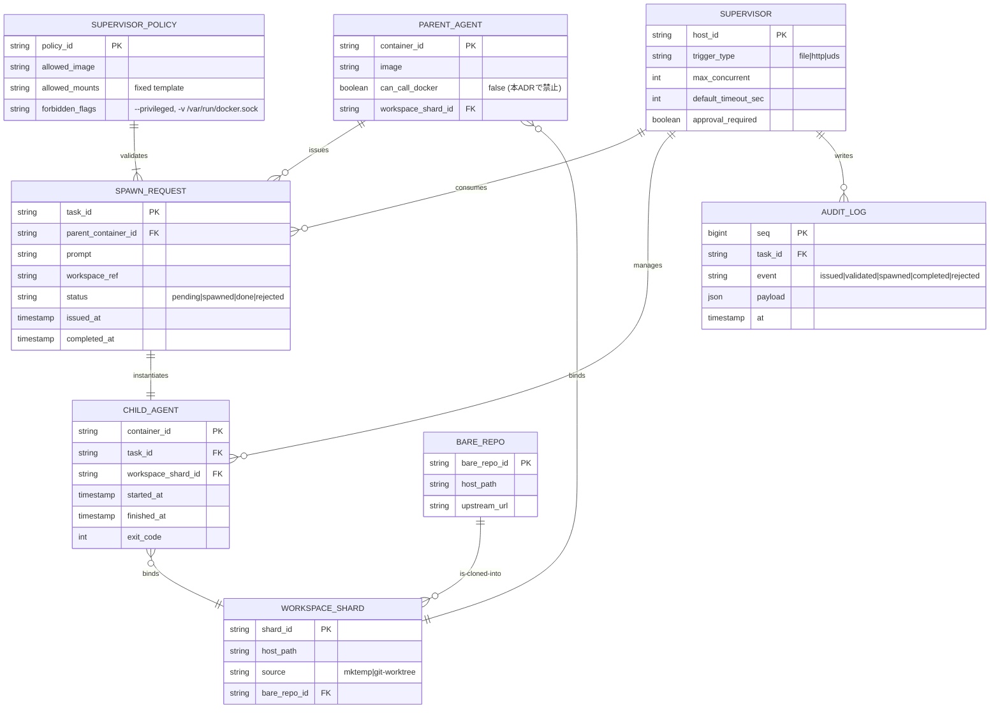
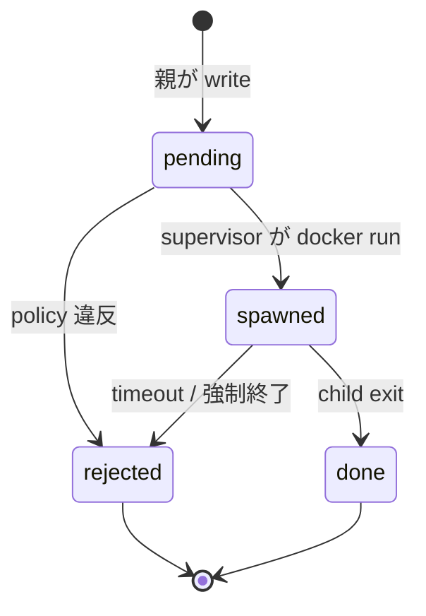
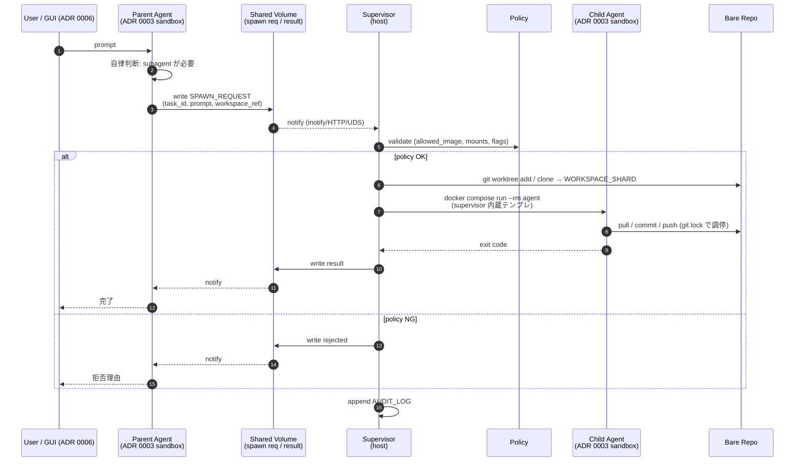
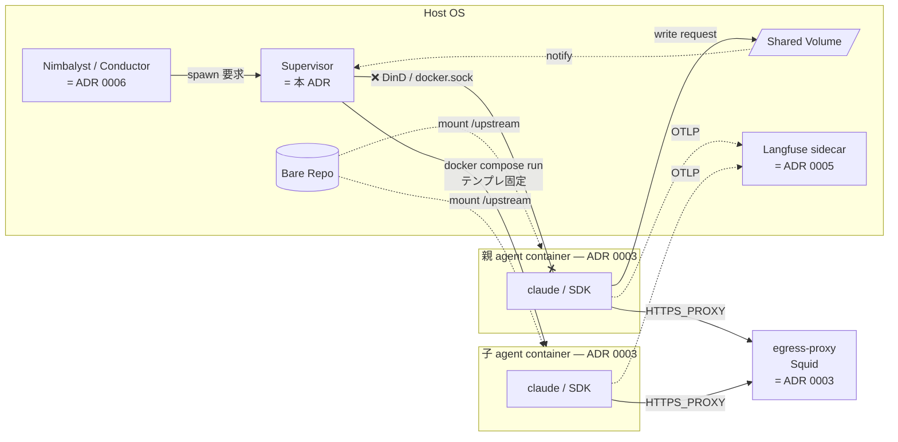

# サブエージェントは外側 supervisor 経由で兄弟コンテナ起動する

## コンテキスト

[ADR 0003](./0003-agent-execution-docker-isolation.md) で agent をコンテナに閉じ込めると決めた。一方で、Claude Code / Agent SDK には **親エージェントがサブエージェントを spawn する**（Task ツール、`.claude/agents/*.md` 定義）パターンがある。

「コンテナの中で動いている親 agent から、さらに別環境で子 agent を起動したい」という要求に対して、どの実装方式を取るかを決める必要がある。隔離設計（`cap_drop: ALL` / non-root / 認証情報非開示）を **崩さない** ことが必須条件。

[research/0003](../research/0003-docker-isolation-for-agents.md) §5 で 5 つの方式（DinD privileged / docker.sock マウント / Sysbox-runc / 外側 supervisor / Docker Sandboxes）を比較した。

## 検討した選択肢

### 選択肢 A: Docker-in-Docker（privileged）

- 利点: 親コンテナ内から直接 `docker run` でき、autonomy が高い
- 欠点: `--privileged` が必要で、ADR 0003 の `cap_drop: ALL` 方針と矛盾。kernel module ロード可となり実質的にホスト root と等価

### 選択肢 B: Docker socket マウント（DooD）

- 利点: 軽量、親から直接 spawn 可能
- 欠点: 実質ホスト root と等価。`docker run -v /:/host` で全権取得が可能で、OWASP / Datadog / Petazzoni らが明確に NG としている。隔離設計を根本から崩す

### 選択肢 C: Sysbox-runc + DinD

- 利点: user namespace 経由で privileged 不要の DinD が実現でき、隔離を崩さずに親から直接 spawn 可能
- 欠点: ホストへ Sysbox runtime をインストールする必要がある。macOS / Docker Desktop で動作しない（Linux ホスト前提）。テンプレートのデフォルトとしては環境依存が大きい

### 選択肢 D: 外側 supervisor が兄弟コンテナを起動

- 親 agent はコンテナの外に **「起動依頼」** を出すだけ。ホスト側 supervisor（systemd / 軽量スクリプト / 簡易 HTTP API）が `docker compose run` を代行する。
- 利点:
  - 親コンテナの `cap_drop: ALL` / non-root / socket 非マウントを **一切崩さない**
  - 親 agent が prompt injection で乗っ取られても、依頼可能な範囲は supervisor の API スキーマ内に閉じ込められる
  - Anthropic 自身の "Building a C compiler with a team of parallel Claudes" と同型（bare repo マウント + git ロックで調停）
  - GUI ツール（Nimbalyst / Conductor）が自然にこの supervisor の UI 実装になる
- 欠点:
  - 親 agent と子 agent 間の通信が「ファイル / 簡易 IPC」を経由するため、直接 spawn より一手間
  - supervisor 側の実装が必要（ただし数十行のシェル / Python で足りる）

### 選択肢 E: Docker Sandboxes (microVM) を都度起動

- 利点: 最強の隔離（Hypervisor + 専用 Engine + workspace + credential proxy の 5 層）
- 欠点: Docker Desktop / 専用 Engine への依存。個人開発者のデフォルトとしては重量級

## 決定

**選択肢 D: 外側 supervisor が兄弟コンテナを起動** を採用する。

選択肢 A / B は明確に **禁止** とする：

- `--privileged` フラグの付与禁止
- ホスト `docker.sock` のマウント禁止

選択肢 C（Sysbox）は **「親 agent から直接 spawn する必要があり、かつ Linux ホスト前提で良い」** という限定条件下のオプションとして残す。テンプレートのデフォルト経路には含めない。

選択肢 E（Docker Sandboxes）は untrusted コードを扱う段階での **将来の隔離強化オプション** として、ADR 0003 と同じく runtime 差し替えで対応する余地を残す。

### supervisor が強制すべきガードレール

実装時に以下を **必須** とする：

1. **テンプレート強制**：起動コマンドは supervisor 内部のテンプレに固定。親 agent から渡せるのは `workspace path` / `prompt` / `task id` 程度に限定。任意マウントや `--privileged` は受け付けない。
2. **同時起動数上限**：fork bomb 防止のため `MAX_CONCURRENT_SUBAGENTS` を設定。
3. **ワークスペース分離**：依頼ごとに `mktemp -d` した dir または git worktree を渡し、親の workspace と物理的に分ける。
4. **タイムアウト**：`--rm` + supervisor 側 wall-clock デッドライン。
5. **監査ログ**：依頼ファイルと結果を残し、後追い可能に。
6. **承認モード（オプション）**：high-stakes な操作だけ人間ゲートにする運用を選択できる構造にする。

### トリガー実装の許容形態

以下のいずれかを spec で選定：

- A. ファイル + inotify（shared volume + systemd path unit）
- B. ローカル HTTP API（host から到達可能な sidecar）
- C. Unix Domain Socket（UDS をマウント）

いずれの場合も「親はホスト docker と話さない」原則を維持する。

## 影響

- 正：ADR 0003 の隔離設計を一切崩さずに、親 → サブの autonomous な実行を実現できる。
- 正：Anthropic の parallel Claudes 事例と整合し、bare repo + git worktree というシンプルな workspace 共有モデルを再利用できる。
- 正：オーケストレーション GUI（[ADR 0006](./0006-orchestration-gui-nimbalyst.md)）が supervisor の UI 実装を兼ねうる。
- 負：親 agent から「直接 docker daemon を呼ぶ」ことができない。エージェント側の実装は「依頼を書く」だけのインターフェイスに合わせる必要がある。
- 負：supervisor 自身の実装・運用責任が発生する（ただし軽量）。
- リスク：supervisor の API スキーマに穴があると、親 agent 経由で任意コンテナ起動が可能になりうる。**テンプレ強制と入力検証を実装時に厳密に行う**。

## 設計図

仕様の理解と後続 spec への橋渡し用。実装時の振る舞いは下記モデルに従う。

### supervisor が扱う実体と関係（ER）

#### 読み方の要点

- **`PARENT_AGENT.can_call_docker = false`** が本 ADR の核：親はホスト docker と話せない。`SPAWN_REQUEST` を **書く** だけ。
- **`SUPERVISOR_POLICY`** が「親から渡せる入力のスキーマ」を強制する。`allowed_mounts` 固定 / `forbidden_flags` 明示により、親が乗っ取られても許可外起動が物理的に作れない。
- **`WORKSPACE_SHARD`** は `mktemp -d` または `git worktree add` で都度生成。親・子で **同じ `BARE_REPO` を共有** することで Anthropic の parallel Claudes 同様、git ロックによるタスク調停が成立。
- **`AUDIT_LOG`** は append-only。`event` が下記の状態機械をなぞる。

### `SPAWN_REQUEST.status` の状態遷移

### autonomous spawn 経路のシーケンス

### ADR ↔ コンポーネント対応

## 参考

- [ADR 0003: エージェント実行は Docker Compose で隔離する](./0003-agent-execution-docker-isolation.md)
- [research/0003: AIエージェントをDockerコンテナに閉じ込めるための手法調査](../research/0003-docker-isolation-for-agents.md)
- [Anthropic: Building a C compiler with a team of parallel Claudes](https://www.anthropic.com/engineering/building-c-compiler)
- [OWASP Docker Security Cheat Sheet](https://cheatsheetseries.owasp.org/cheatsheets/Docker_Security_Cheat_Sheet.html)
- [Sysbox](https://github.com/nestybox/sysbox)
