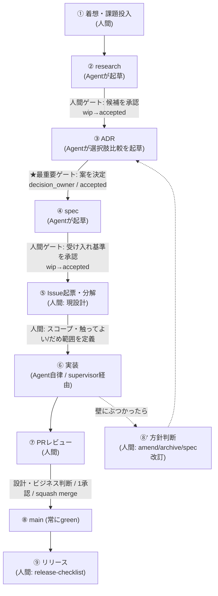

# 人の導線（Human-in-the-Loop）

> このプロジェクトで AI Agent と協働するとき、**人間がどこで手を動かし、どこを Agent に任せるか**を定義するガイド。
> 全体フローは [workflows.md](./workflows.md)、ループの回し方は [development-loop-playbook.md](./development-loop-playbook.md)、GitHub運用の根拠は [ADR 0007](../adr/0007-github-operations-model.md) / [spec 0006](../spec/0006-github-workflow.md) を参照。

## 原則: 人は「決定と境界」、Agent は「起草と実行」

不可逆な判断と安全境界だけを人間ゲートにし、調査・起草・コーディングは Agent に寄せる。
この非対称構造を支えるのが次の2つの仕組み:

- **ドキュメントの `wip → accepted` 昇格** … 人間の承認ゲート（[document-lifecycle.md](./document-lifecycle.md)）
- **ADR の `decision_owner` と PR の review/merge** … 人間が最終判断を握る印

> Agent は research も ADR本文も spec も**書ける**が、`決定`（どの案を採るか）と `accepted 昇格`、`PR merge` だけは人間が握る。

## 全体フローと人間ゲート



| 段階 | 主にやるのは | 人間ゲート（何を判断するか） |
|---|---|---|
| ① 着想・課題投入 | **人間** | 「何をやりたいか / 調べたいか」を起点として渡す |
| ② research | Agentが起草 | 候補群と根拠を**承認**（`wip→accepted`）。採否はまだ決めない |
| ③ **ADR（最重要ゲート）** | Agentが選択肢比較を起草 | **どの案を採るか決定**。`決定`セクションと `decision_owner` は人間のもの |
| ④ spec | Agentが起草 | **受け入れ基準（=契約）を承認**（`wip→accepted`） |
| ⑤ Issue起票・分解 | **人間**（現設計） | 大枠Issueでスコープと**触ってよい/だめ範囲**を定義。粒度・`agent:local` ラベルを確定 |
| ⑥ 実装 | **Agent（supervisor経由・自律）** | 入らない「機械ゾーン」 |
| ⑦ PRレビュー | 人間 | 設計・ビジネス判断、最低1承認、merge（squash） |
| ⑧' 壁にぶつかった時 | 人間 | ADR amend / archive / spec改訂 のどれかを判断（[playbook §3](./development-loop-playbook.md)） |
| ⑨ リリース | 人間 | [release-checklist.md](./release-checklist.md) |

人間が触るのは **①③④⑤⑦⑧'⑨**、Agent が自律で回すのは **②起草・⑥実装**。

## 代表シナリオ

### シナリオA: 大枠Issue → サブIssue分解（段階⑤）

人間が **親Issue（Epic）** でスコープと禁止範囲を書き、サブIssue（task list）へ分解する。

> ⚠️ **設計上の重要な境界**: [spec 0006](../spec/0006-github-workflow.md) の supervisor 連携契約では、Agent の GitHub トークンは `issues:read`（Issueは**読むだけ**）。
> したがって **Issue / サブIssue の起票は人間の作業**である。

「Agent にもサブIssueを切らせたい」場合は、supervisor トークンを `issues:write` に広げる必要がある。
これは安全境界を緩める**意図的な拡張**であり、やるなら spec改訂 または ADR amend で明示する（[token境界](#issue起票の境界とtokenスコープ)参照）。

### シナリオB: research → 再構成 → ADR を作らせる（①→②→③）

```text
人間: 「Xを調べて」                         （① 投入）
  ↓  Agent: deep-research 等で調査 → research wip 起草（② 起草）
人間: research をレビューして accepted        （② ゲート）
  ↓  Agent: 候補から選択肢比較を再構成 → ADR wip 起草（③ 起草）
人間: 「この案でいく」と決定 → ADR accepted    （③ ゲート＝最重要）
  ↓  Agent: spec wip 起草                    （④ 起草）
人間: 受け入れ基準を承認 → spec accepted       （④ ゲート）
```

Agent が本文を書いても、**`決定` と `accepted 昇格` を人間が握る**ことで「最終的に ADR を作ってもらう」を安全に成立させる。

## Issue起票の境界とtokenスコープ

人間/Agent の分担は **GitHub トークンのスコープに直結**する。現設計（MVP）と拡張時の対応:

| 操作 | 現設計（MVP / fine-grained PAT） | 主体 | Agentにやらせたい場合 |
|---|---|---|---|
| Issue を読む | `issues:read` | Agent (supervisor経由) | — |
| Issue / サブIssue 起票 | 付与しない | **人間** | `issues:write` を追加（spec改訂で明示） |
| 実装結果の push | `contents:write`（固定branch） | Agent (supervisor経由) | — |
| PR 作成 | `pull_requests:write` | Agent (supervisor経由) | — |
| PR merge | 付与しない | **人間**（review後） | merge は人間ゲートに固定 |

> トークンは supervisor プロセス環境にのみ置き、agent コンテナには渡さない（[ADR 0004](../adr/0004-subagent-execution-pattern.md) / [ADR 0007](../adr/0007-github-operations-model.md) の境界）。
> 権限を広げる = 安全境界を緩める、という対応関係を常に意識する。

## 最小の人間導線（要約）

1. **入口**: 課題 / 問いを投げる（①）
2. **判断ゲート**: research承認 → **ADR決定** → spec承認 → Issue境界定義（②③④⑤）
3. **出口ゲート**: PRレビュー&merge → 壁での方針判断 → リリース（⑦⑧'⑨）

間（②起草・⑥実装）は Agent が埋める、という非対称構造を保つ。

## 関連ドキュメント

- [workflows.md](./workflows.md) — 開発フロー全体像
- [development-loop-playbook.md](./development-loop-playbook.md) — ループの回し方・amend判断
- [multi-agent-playbook.md](./multi-agent-playbook.md) — 複数Agent協調時の運用
- [ADR 0007](../adr/0007-github-operations-model.md) — GitHub運用モデル（人間ゲートの根拠）
- [spec 0006](../spec/0006-github-workflow.md) — Issue/PR/CI と supervisor連携の契約
